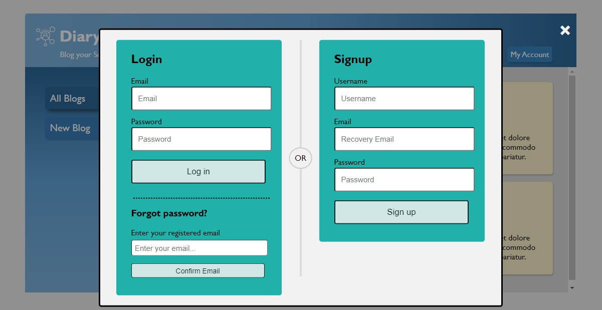
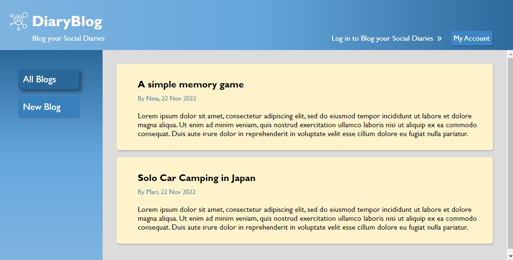

# DiaryBlog (<font size='3'> V2: Signup, Login and Logout capabilities included </font>)

#### By _**Mahashi-github**_

#### Blog your most precious diaries. This is a Javascript & Node.js application using which users can create their personal accounts, then the application will grant them permission to blog their diaries and delete their posted diaries. This application authenticates you to access its protected routes and authorizes you to blog your diaries. There is also a password reset option in case users forget their password. Error handling for signup and login processes is also provided. 

## Technologies Used
* _html_
* _css_
* _javascript_
* _node.js_
* _express_
* _express router & MVC_
* _ejs_
* _mongoose_
* _validator_
* _bcrypt_
* _dotenv_
* _jsonwebtoken_
* _cookie-parser_

## Setup
A env file with an ACCESS_TOKEN_SECRET variable is required. To run this project, install it locally using npm:

```
$ npm install
$ nodemon app
```
## Notes & Acknowledgements
Regarding the auth part of this code, I would like to appreciate the "Node.js Auth Tutorial (JWT)" series by "_The Net Ninja_" available on the YouTube channel: https://www.youtube.com/playlist?list=PL4cUxeGkcC9iqqESP8335DA5cRFp8loyp. In general, "_The Net Ninja_"'s valuable tutorials are recommended. 

I have implemented some changes in generating access tokens and assigning unique usernames. I have also added a password reset option.

## Screenshot of the Application
<p>
  
  
</p>